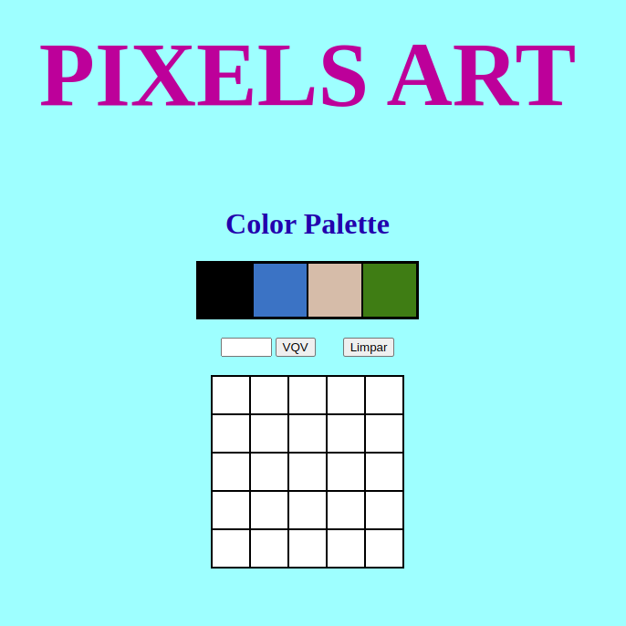

## Pixel Art Project

## Description
Project developed during the Trybe software development course.
This Project consists of a functional color palette that can be used to create pixel drawings.

## Tools

- Javascript ES6;
- HTML5;
- CSS3.

## Skills developed

- DOM manipulation
- Javascript manipulation